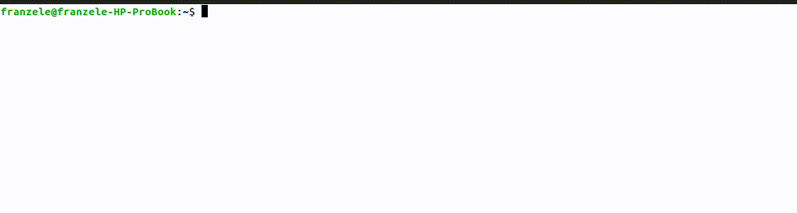

# Automatic Video Blurring Using YOLOv8 Model

This project allows automatic blurring of a video contained in a .bag file (in ROS1 format [ROS2 not fully implemented yet]).

## Prerequisites
The project was developed using Python 3.10.12, so it is recommended to have this version or higher.

## Installation
First, clone this Git repository by running:
```
git clone https://github.com/franzele21/ros_blur.git
```
Then enter the project directory and download the necessary modules:
```
cd ros_blur
python3 -m pip install -r requirements.txt
```

In the beginning of the script, you will find a line like:
```python3
ROS_SETUP_FILE = "/opt/ros/humble/setup.sh"
```

You will have to change if the line to the path of your ROS setup file. (it will [normally] have this form `/opt/ros/$YOUR_VERSION/setup.sh`).

## Usage
To use the program, simply type the following command in the command line:
```
python3 blur_bag.py path/to/file.bag path/to/model.pt bag_version
```

With the first argument being the path to the bag file containing the video to be blurred, the second argument is the Yolov8 weights that will be used to find the areas to blur (for example, a model that can detect [faces](https://github.com/akanametov/yolov8-face) for blurring). The third argument is the bag version (either 1 or 2).

You can also add the following options:
| Command           | Alternative Form | Description                               |
|-------------------|------------------|-------------------------------------------|
| `--output_file`   | `-o`             | Path/name of the output             |
| `--frame_rate`    |                  | Sampling interval                         |
| `--topic`         |                  | Topic where the video is saved            |
| `--black_box`     |                  | Replaces blurring with a black box (faster than blurring) |
| `--orig_mp4` |                  | Make the mp4 video of the bagfile before blurring |
| `--new_mp4` |                   | Make the mp4 video of the bagfile after blurring |
| `--verbose`       | `-v`             | Displays process progress                 |

Demonstration:



## Program Explanation

The blurring process of this programm is optimized for videos that has potentially not a lot of blurring to make, because we don't check every frame in the video (not necessary if the event isn't that frequent) but every frame in at regular intervals.

Those selected frames will be given to a Yolov8 model, to see if there is any zones that the model recognised. If the model sees anything, this frame and its neighbours will be checked by the model. The other frames won't pass in the Yolo model, making this algorithm faster (because the detection is a bottleneck).

To the choice of the frame verification rate, taking a small one will make that the algorithm will check more often, making the algorithm more precise but making it take more time, and taking a big frame verification rate will make the algorithm faster, but could miss some detections.

Here is a schema of how the algorithm works: 


First phase, the "sampling" phase:


In this example, the frame verification rate is equal to 4. Here we can see that the algorithm will take a sampling frame, will process it through the detection model, and the result of the detection will mark those frame sample either True or False.

Second phase, the "verification" phase:


In this second phase, the algorithm will either:
- If the sample frame is marked True, that means that this frame and its neighbours will be processed in the detection model, the detection will be blurred, and the new frame will be written in the new video.
- If the sample frame is marked False, those frame will be directly written in the new video.

Here is a pseudocode of the blurring algorithm:

```
min_confidence = None // Minimum confidence threshold for detection

// Initialize containers for image processing
image_batch = [] // To store a batch of images
detection_boxes = [] // To store detection boxes for each image

// First phase: the "sampling" phase

// Read messages from input
FOR EACH image IN input
    APPEND image to image_batch

    // Check if a batch is ready for detection
    IF length of image_batch EQUALS frame_verif_rate THEN
		// Sampling
		SELECT middle_image from image_batch for detection


		// Perform detection using the model
		SET detection_flag to TRUE IF DETECT in middle_image
		
		// Apply detection results to all images in the batch
		// Verification phase
		FOR EACH image IN image_batch:
			IF detection_flag:
				detected_boxes = DETECT in image
				FILTER detected_boxes by confidence
				APPEND to detection_boxes
			ELSE:
				APPEND empty list to detection_boxes
			ENDIF
		ENDFOR
	ENDIF

	// Reset image batch after processing
	CLEAR image_batch
ENDFOR


// Process any remaining **images** in the batch
IF image_batch is not empty:
PERFORM detection on last image in batch
REPEAT steps as above for detection and storing boxes


// Apply blurring to images and write to output
FOR EACH message IN input:
    RETRIEVE corresponding detection_boxes
	IF length(detection_boxes) greater than 0 THEN
    	APPLY blurring to image using detection_boxes
	ENDIF
    WRITE image to output
ENDFOR
```

In this pseudocode, the "sampling" is done by taking the middle frame of the batch. The batch size is the given frame rate. If the sampled frame has a detection in it, then we will check for all its neighbouring frames (so it is the verification phase). 

To avoid flickering, that can happen because the Yolov8 model didn't see an element but did some frames before and after, the method `fill_list` is used to counter this. This method will see if a box from the previous frame has not a correspondance to a box of the current frame (the box disappeared) and if this box reappear in the next frames. If this happens, it will cause a flickering of a box of blur.

To correct this, `fill_list` will add a box where it is missing (here, in the current frame). This new box will be the mean of the previous box that is missing and its correspondance in the next frame. 

To effectevly counter the flickering, `fill_list` will not just check the next frame, but the next `frame_rate` next one (default=5). So even if the model didn't pick at all an element, it will be filled.

`fill_list` will also add boxes to the frames before they were detected by the model, so it will begin to blur before the model detected it. It can counter when the model predict too late that there is something to blur.

## ROS2 Process

Because I didn't found how to directly put data in a ROS2 bagfile, I had to do a workaround. 

There is a command called `rosbags-convert` (coming from the `rosbags` module [the "s" at the end is important]) that can be used to convert a bagfile to an another format.

Because we can already blur a video contained in a ROS1 bagfile, we can use the same program to do it for a ROS2 bagfile, just by converting it into an another ROS1 bagfile, doing the blurring, and then re-converting it into a ROS2 bagfile. Because we only know one topic from the original bagfile (that is, the topic where the video is saved), we can create a bagfile from with only this topic in it, and then merge the two bagfile. 

To avoid conflicts, we delete the video in the original bagfile.


Unfrtunatly, because of the usage of `rosbags-convert`, we cannot merge with unknown topic, so there can be a loss of information.

## Troubleshooting

If you get the error:
```
ImportError: cannot import name 'Log' from 'rosgraph_msgs.msg' (/opt/ros/humble/local/lib/python3.10/dist-packages/rosgraph_msgs/msg/__init__.py)
```

It is because there is a conflict between the imported module and your ROS. 
To correct this, you will have to open a new terminal, without sourcing the `/opt/ros/$ROS-VERSION/setup.bash` (or `setup.sh`) of your ROS. 

If the problem persist, check in the `~/.bashrc` file if there isn't a line like `source /opt/ros/$ROS-VERSION/setup.bash`. If there is, comment this line.

If the problem persist, try this command:
```
python3 -m pip install --force-reinstall --extra-index-url https://rospypi.github.io/simple/ rospy rosbag
```
